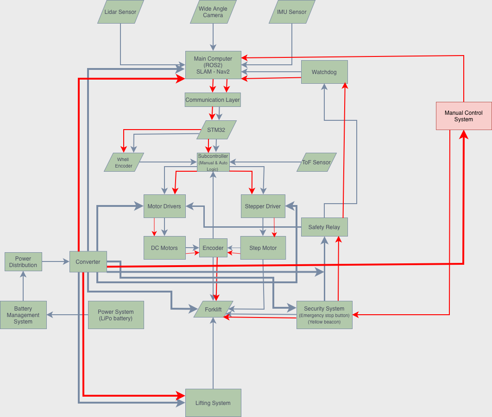

# TEKNOFEST 2026 - Sanayide Robotik Uygulamalar Yarışması
## Otonom Forklift Robotu Yazılım ve Arayüz Kodları

  
  
  
  

---

 Proje Hakkında
Bu proje, TEKNOFEST 2026 Sanayide Robotik Uygulamalar Yarışması kapsamında geliştirilen **Otonom Forklift Robotu**'nun merkezi yazılım, navigasyon ve kullanıcı arayüzü (UI) kodlarını içermektedir. Projenin temel amacı, endüstriyel depo ortamlarında paletlerin otonom olarak taşınması, haritalama, rota planlaması ve güvenli operasyon yönetimini sağlamaktır.

- Otonom Navigasyon: ROS2 mimarisi ve Nav2 kullanılarak rota planlama.
- Haritalama ve Lokalizasyon: LiDAR kullanarak SLAM algoritmaları ile hassas konumlandırma.
- Kullanıcı Dostu Arayüz: Robotun anlık durumunu, hızını, batarya seviyesini ve haritadaki konumunu gösteren kontrol paneli.
- Güvenlik Sistemleri: Acil durum durdurma entegrasyonu ve nesne algılama ile çarpışma önleme.

 Sistem Akış Şeması
Projenin yazılım mimarisini anlamak için aşağıdaki akış şemasını inceleyebilirsiniz:

